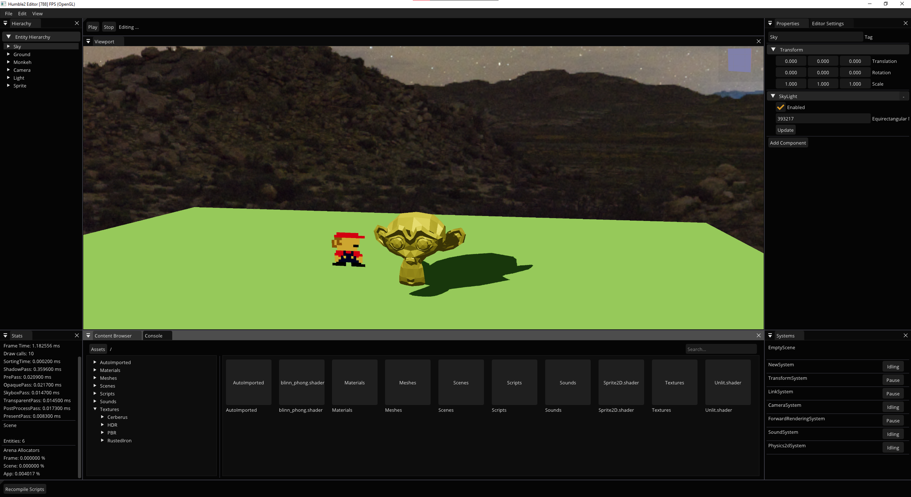

# Humble2

Humble2 is a simple 3D & 2D game engine with an ECS architecture.

Features:
---------

- Supports multiple graphics APIs **OpenGL 4.6** and **Vulkan**.
    - **WebGPU**  support is planned for the future.
- Complete UI Editor for creating applications / games.
- Uses an ECS architecture using the [EnTT](https://github.com/skypjack/entt) library.
- Fully integrated C++ scripting support.
- Powerfull physics support for 2D (using [Box2D](https://github.com/erincatto/box2d)) and 3D (using [Jolt](https://github.com/jrouwe/JoltPhysics)) games.
- Support for prefabs (Instantiate, Unpack, Update, Destroy).
    - Nested prefabs support is planned for the future.
- Planned web support with [Emscripten](https://github.com/emscripten-core/emsdk) using WebGPU to build games for the browser.
- Currently supports only Windows.

Installation:
-------------

- Clone the repo recursively: ```git clone --recursive https://github.com/johnoyo/Humble2.git```
    - If the repo was not cloned recursively, call this to initialize the submodules: ```git submodule update --init```
- Run the GenerateProjectsVC20XX.bat file.
    - There are two default batch files, one for Visual Studio 2019 and one for 2022.
- Open the generated Visual Studio solution.

- NOTE: You need to have installed the [VulkanSDK](https://vulkan.lunarg.com/sdk/home) with the optional debug libraries.

Screenshots:
------------

